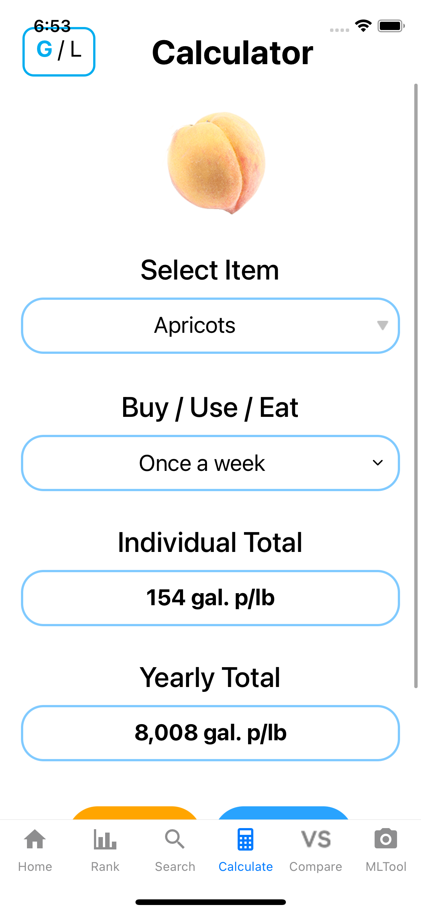
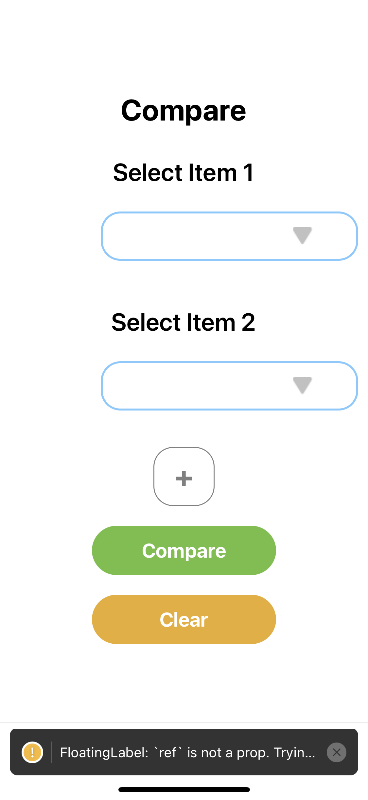

# About this branch

This branch doesn't have **Expo**, which means you can't tune the app on your phone via `expo start`. You can only run
this app through `npm start` and then run it from Xcode on a simulator. If you are running an iOS 14.5 simulator on a m1 
chip Mac, the app will crash when you enter the MLTool tab. However, it should run well on a real device. If we have a 
developer account, we can verify this.

What's more, most of the camera components will not run on a simulator because it's impossible to access the camera of our
machine to be used as a simulator camera. If you want to tune the app on a simulator, solution can be `'yarn remove expo-camera'` 
and using a different component that can simulate a device camera ([react-native-camera-kit](https://github.com/teslamotors/react-native-camera-kit) 
for example).  

The project I showed before is initiated through `expo init` and then I copied our code into the blank Expo project so 
that I can get it running on my phone. However, because Expo uses different (newer) dependencies, all tools are in error
state except MLTool (see screenshots at the end). It will take some time to upgrade our code (what I am trying to do now)
to meet requirements of newer versions of all those dependencies. 

In conclusion, it is better if we can migrate our project to Expo in the long run, so that we can tune it with our phone.
 For now, our target is polishing the UI for prototype presentation, I think we can either comment out the expo-camera 
component to prevent crash , or we don't work on this branch and just start from scratch to build a brand-new beautiful 
page (no matter which way, then I just copy our new code to my Expo project and add the camera back to record a video 
on my phone).
***  

# New dependencies added
1. "@react-native-async-storage/async-storage": "^1.15.8"
2. "@tensorflow-models/mobilenet": "^2.1.0"
3. "@tensorflow/tfjs": "^3.9.0"
4. "@tensorflow/tfjs-react-native": "^0.7.0"
5. "jpeg-js": "^0.4.3"
6. "react-native-fs": "^2.18.0"
7. "react-native-unimodules": "^0.14.9"
8. "expo-camera": "^11.2.2"
9. "expo-gl": "^10.4.2"
10. "expo-image-manipulator": "^9.2.2"
11. "expo-image-picker": "^10.2.3"  
12. "typescript": "^4.4.3"  
***  

# Changes on files and folders
1. Added 'MLTool' folder and files for MLTool under it
2. Added 'Screenshots' folder for README
3. Modified 'app.json' to test Expo (Doesn't affect anything)
4. Modified files in ios folder to apply react-native-unimodules so that we can use many great expo components(see 
document: [unimodules](https://docs.expo.dev/bare/installing-unimodules/))
5. Modified 'package.json' to add dependencies
6. Modified 'App.js' to apply react-native-paper (see document: [react-native-paper](https://callstack.github.io/react-native-paper/getting-started.html))
7. Modified 'LandingPage.js' to add the MLTool tab  
***

# How to run this project
### First: In IDE
1. Open this project in VSCode ,WebStorm, ...
2. Open a terminal under the project root.
3. Run `npm install` or `yarn install`.
4. Enter ios folder through `cd ios` and then do `pod install`. If using m1 chip mac, run `arch -x86_64 pod install`.
5. Go back to root folder by `cd ..`.
6. Start through `npm start`.
### Second: In Xcode
1. Open Xcode and open our project `AwesomeProject.xcworkspace` under ios folder.
2. Run on simulator.
***

# How to tune the app
Simply go back to your IDE and edit anything you want, and you should see changes. If you need to add new dependencies, 
remember to do `pod install` under ios folder.
***

#Screenshots
###This branch (running on iOS 14.5 simulator without Expo):
Home, Rank, Search, Calculate, and Compare all work perfectly.  

  

  

  

If tap **MLTool**, app will crash.  

  

###Another branch I am working on (running on real device with Expo):  
All tools except MLTool have errors. Data can't render in the picker.  

  

MLTool works fine.  

  

  

  

